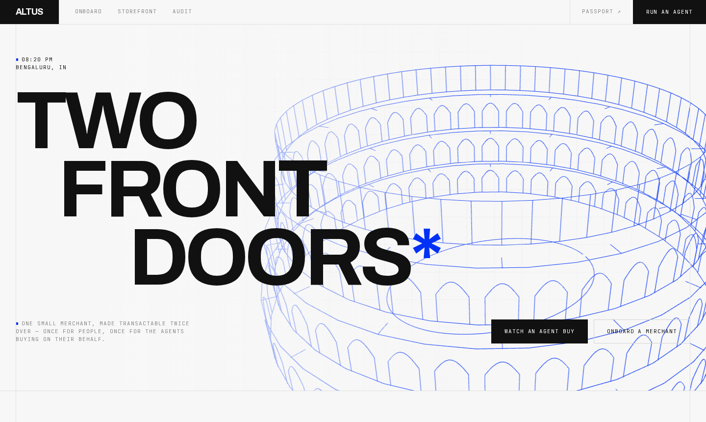
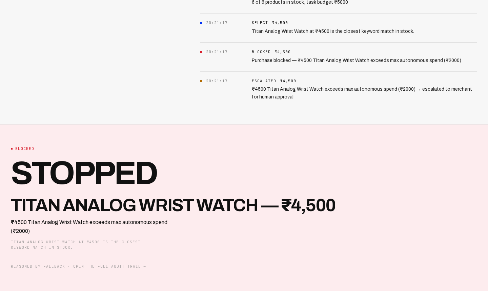
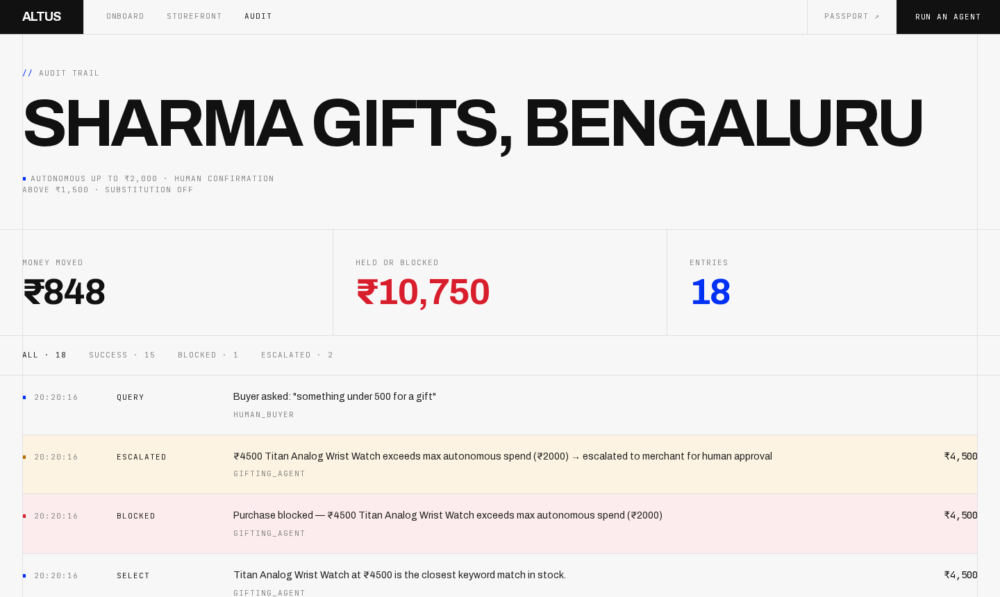
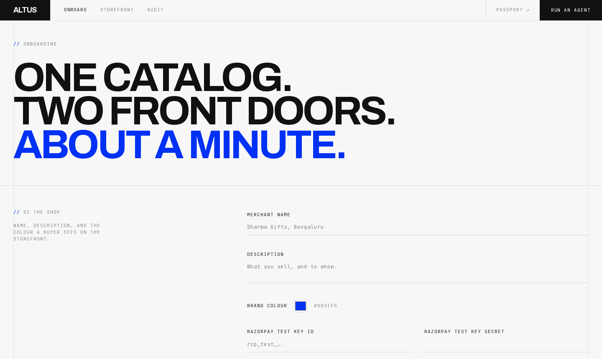
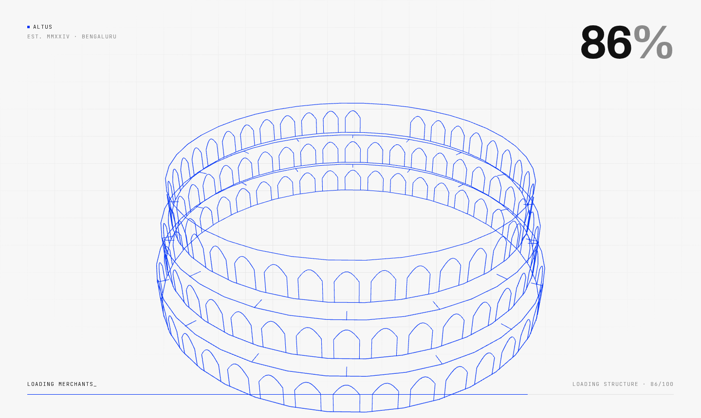
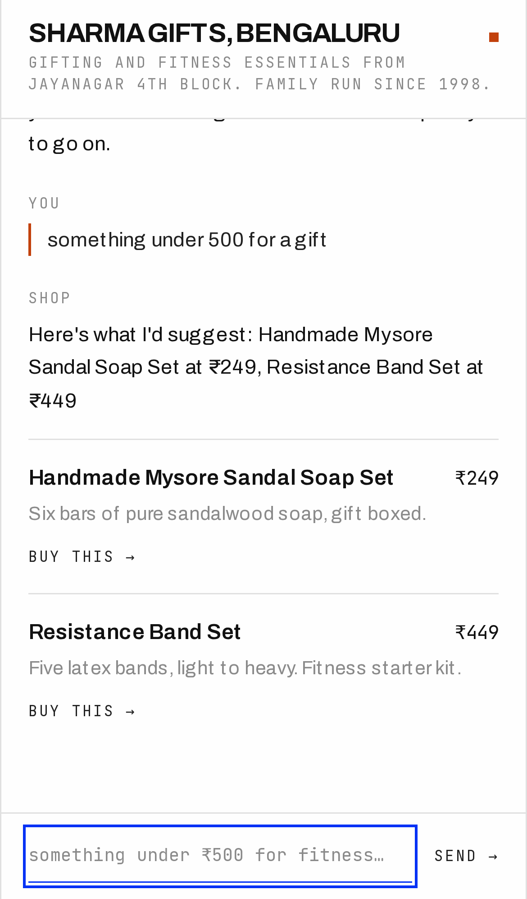

<div align="center">

# Altus

**One small merchant, transactable twice over — once for people, once for the agents buying on their behalf.**

A chat storefront for humans and a machine endpoint with a spending passport for AI buyers.
One catalog, one audit trail, Razorpay test mode underneath.

[](https://nextjs.org)
[](https://react.dev)
[](https://fastapi.tiangolo.com)
[](https://threejs.org)
[](LICENSE)



</div>

---

## The problem

Agents are starting to buy things. Nobody has told the merchant how to say
**"₹2000 is fine, ₹4500 needs me."**

Every autonomous-shopping demo puts that decision inside the model's prompt —
which means the guardrail is a suggestion, and the merchant is trusting a
stranger's language model with their inventory and their money.

Altus moves the decision out of the model and into the merchant's code path.

## How it works

```
frontend/   Next.js 15 App Router + Tailwind — all the UI
backend/    FastAPI + SQLite — every /api/* route
```

Next.js owns no API routes. `frontend/next.config.ts` rewrites `/api/*` to
FastAPI on `:8000`, so the browser, a phone on the LAN, and a third-party
agent all hit the same origin and the same code.

## Policy is enforced in code, not by the model

`llm.pick()` only **proposes** a product. `run_agent()` in `backend/main.py`
decides what happens to it, in this order:

| | Condition | Outcome |
|---|---|---|
| **01** | Over `max_autonomous_spend` | **BLOCKED**, then **ESCALATED** to the merchant |
| **02** | Over `requires_confirmation_above` | **ESCALATED** — waits for a human |
| **03** | Within policy | Order created, stock decremented, receipt returned |

Every branch writes an audit row with a timestamp, the amount and the reason —
so a blocked ₹4500 watch reads back as:

> ❌ Purchase blocked — ₹4500 Titan Analog Wrist Watch exceeds max autonomous spend (₹2000)

The agent in the screenshot below was given a **₹5000 budget**. It had the
money and still could not spend it, because the merchant's cap is ₹2000.



## The five surfaces

| Page | What it does |
|---|---|
| `/onboard` | Shop details, catalog builder, agent policy → merchant id, QR code, agent endpoint |
| `/shop/[merchant_id]` | Mobile-first chat storefront; Claude reads the catalog, a Razorpay link closes the sale in-chat |
| `/dashboard/[merchant_id]` | Live audit trail, filterable by completed / blocked / escalated |
| `/demo` | Give an agent a task and a budget, watch each step stream in over SSE |
| `/api/agent/[merchant_id]` | The Agent Passport — catalog plus the rules a machine buyer must obey |

<table>
<tr>
<td width="50%"><br><em>Audit trail — money moved and money held, set as headlines</em></td>
<td width="50%"><br><em>Onboarding — catalog and agent policy in about a minute</em></td>
</tr>
<tr>
<td><br><em>The amphitheatre draws itself in as the counter runs</em></td>
<td align="center"><br><em>Scan the QR, buy from a phone — no app, no account</em></td>
</tr>
</table>

## Run it

```bash
git clone https://github.com/adityachawla005/altus
cd altus

python3 -m venv backend/.venv
backend/.venv/bin/pip install -r backend/requirements.txt
(cd frontend && npm install)

cp .env.example .env      # keys optional, see below
./dev.sh
```

`dev.sh` prints two addresses:

```
  this machine   http://localhost:3000
  on the LAN     http://192.168.1.20:3000  ← browse here, or QR codes are a dead end
```

First boot seeds **Sharma Gifts, Bengaluru** with six products (₹249 – ₹4500)
and the policy `max_autonomous_spend=2000`, `requires_confirmation_above=1500`.

Self-check for the policy, money and QR paths, offline:

```bash
backend/.venv/bin/python backend/test_altus.py
```

## API

```
GET  /api/agent/{merchant_id}            Agent Passport + catalog
POST /api/agent/{merchant_id}/buy        Autonomous purchase  (?stream=1 for SSE)
POST /api/chat/{merchant_id}             Human chat with the shop
POST /api/payment/create                 Razorpay payment link
POST /api/payment/verify                 Confirm a payment (signature or link status)
GET  /api/audit/{merchant_id}            Full audit trail
POST /api/merchants                      Onboard a merchant
GET  /api/qr/{merchant_id}               Storefront QR as SVG
```

The passport a machine buyer reads:

```jsonc
{
  "merchant": { "id": "sharma_gifts", "name": "Sharma Gifts, Bengaluru" },
  "capabilities": ["browse", "purchase", "check_inventory"],
  "products": [
    { "id": "sharma_gifts_p1", "name": "Handmade Mysore Sandal Soap Set",
      "price": 249, "stock": 40, "currency": "INR", "purchase_allowed": true },
    { "id": "sharma_gifts_p6", "name": "Titan Analog Wrist Watch",
      "price": 4500, "stock": 5, "currency": "INR", "purchase_allowed": false }
  ],
  "rules": { "max_autonomous_spend": 2000, "requires_confirmation_above": 1500 }
}
```

`purchase_allowed` is computed per product against the merchant's policy — the
agent is told what it may buy before it tries.

## Keys

Both are optional; Altus degrades to something you can still demo.

| Variable | Without it |
|---|---|
| `ANTHROPIC_API_KEY` | Chat and the agent fall back to a deterministic keyword/price matcher. Responses report `"model": "fallback"`. |
| `RAZORPAY_KEY_ID` / `_SECRET` | Checkout is simulated: ids are prefixed `sim_`, receipts carry `simulated: true`. A merchant may supply its own keys at onboarding, which take precedence. |
| `PUBLIC_BASE_URL` | Only needed behind a real domain or tunnel. Left unset, the server works out the LAN address a phone can reach, so QR codes resolve off-device on whatever network you are on. |

## Notes on the money

Money is whole rupees in `INTEGER` columns everywhere; paise conversion happens
only at the Razorpay boundary.

The autonomous path creates a real test-mode order and books it as
`PAID_TEST_MODE` — Razorpay has no server-side API to actually pay an order
without a checkout, so **nothing here claims a captured payment it didn't
get**. The human path is a genuine end-to-end test-mode payment.

## The 3D is generated, not downloaded

`frontend/app/components/Amphitheatre.tsx` builds a Roman amphitheatre in
three.js line geometry at runtime — four tiers, arcade piers with true
semicircular arches (rise derived from the chord, which is what separates a
Roman arcade from a gothic lancet), radial ties, arena ellipse. No `.glb`, so
the repo stays binary-free, and the same mesh serves the loading screen
drawing itself in and the hero idling behind the type.

## Not built, as scoped

Auth (`merchant_id` is the identifier), live payments, multi-currency.

## License

[MIT](LICENSE)
